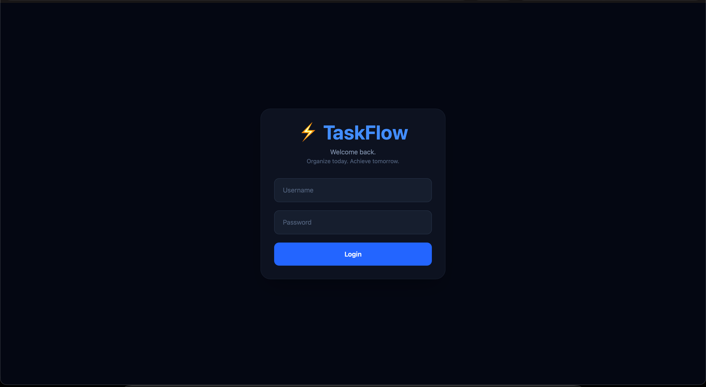
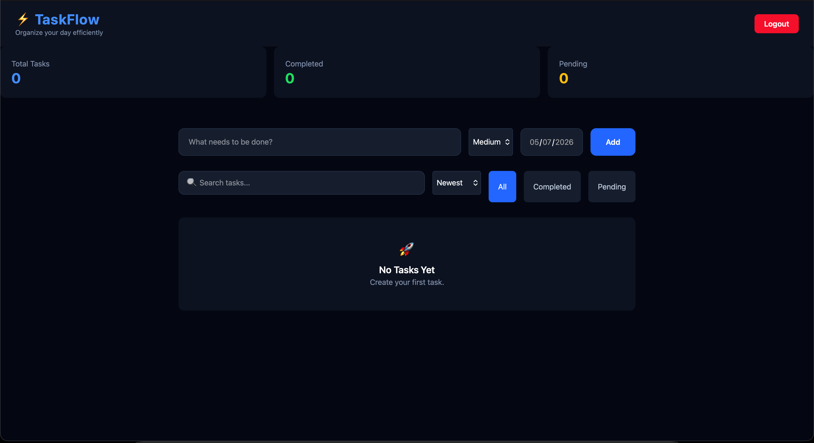

# ⚡ TaskFlow

> A modern task management application built with **React**, **Vite**, and **Tailwind CSS** to help users organize their daily workflow.


---

## 🌐 Live Demo

🔗 https://task-flow-five-ochre.vercel.app/

---

### Login Page

<p align="center">
  
</p>

### Dashboard

<p align="center">
  
</p>

---

# ✨ Features

- 🔐 Authentication
- 🛡 Protected Routes
- ➕ Add Tasks
- ✏ Edit Tasks
- 🗑 Delete Tasks
- ✅ Mark Tasks Complete
- 🔍 Live Search
- 🎯 Task Filtering
- ↕ Sorting
- 🚦 Priority Levels
- 📅 Due Dates
- 💾 Local Storage
- 📊 Dashboard Statistics
- 📱 Responsive Design
- 🌙 Modern Dark UI

---

# 🛠 Tech Stack

| Technology | Purpose |
|------------|---------|
| React | Frontend Library |
| Vite | Build Tool |
| Tailwind CSS | Styling |
| React Router | Routing |
| Context API | Authentication |
| Local Storage | Data Persistence |

---

# 📂 Folder Structure

```text
src/

├── components/
│   ├── Navbar.jsx
│   ├── TaskCard.jsx
│   ├── TaskForm.jsx
│   ├── TaskList.jsx
│   ├── FilterBar.jsx
│   └── Stats.jsx
│
├── context/
│   └── AuthContext.jsx
│
├── pages/
│   ├── Login.jsx
│   └── Dashboard.jsx
│
├── routes/
│   └── ProtectedRoute.jsx
│
├── App.jsx
└── main.jsx
```

---

# 🚀 Getting Started

Clone the repository

```bash
git clone https://github.com/Avik0333/TaskFlow.git
```

Move into the project

```bash
cd TaskFlow
```

Install dependencies

```bash
npm install
```

Run locally

```bash
npm run dev
```

Open

```
http://localhost:5173
```

---

# 🎯 Future Improvements

- Backend Integration
- User Accounts
- Cloud Database
- Drag & Drop Tasks
- Notifications
- Calendar Integration

---

# 📖 What I Learned

While building **TaskFlow**, I strengthened my understanding of:

- React Components
- React Router
- Context API
- State Management
- CRUD Operations
- Local Storage
- Tailwind CSS
- Component Architecture
- Responsive Design
- Modern UI Development

---

# 👨‍💻 Author

**Avik Sehgal**

First Year B.Tech – Robotics & Automation

Passionate about

- Artificial Intelligence
- Full Stack Development
- Robotics
- Automation

GitHub

https://github.com/Avik0333

LinkedIn

(Add your LinkedIn here)

---

## ⭐ If you like this project, consider giving it a star!
